# Job Scalper

**An AI-powered job-search copilot for engineers.** It aggregates remote tech roles from
many job boards, scores each one against your résumé with a transparent 0–100 match, and
turns a promising posting into a tailored résumé and cover letter in one tap — then tracks
every application from *applied* to *offer*.

> Built end to end: a **FastAPI** backend (async API + background worker + admin console)
> and a **Flutter** mobile app, sharing one multi-tenant **PostgreSQL** database.

  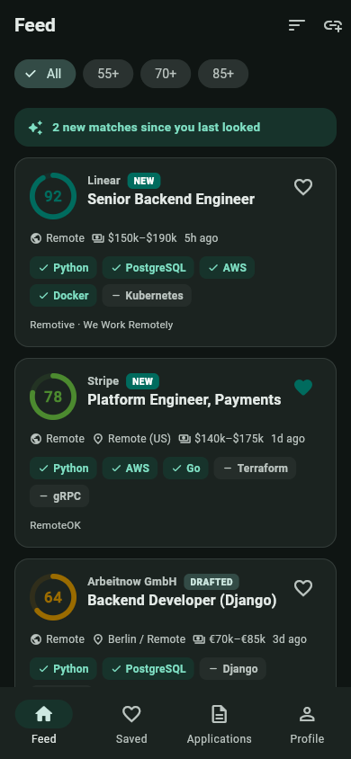
  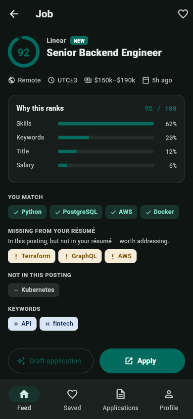
  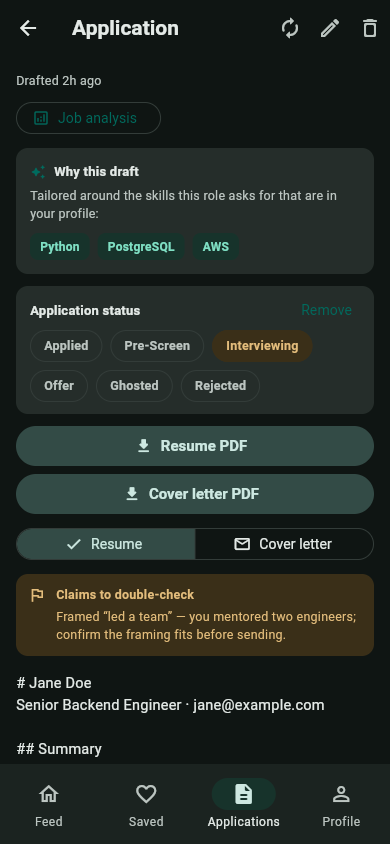

---

## Why it exists

Job hunting as an engineer is a volume game with a quality tax: hundreds of near-duplicate
listings across a dozen boards, each demanding a bespoke résumé and cover letter. Job Scalper
removes both frictions — it **ranks the whole market for you** and **does the tailoring for
you** — so your time goes to the handful of roles that actually fit, and to the interviews.

---

## Feature tour

### 🎯 A ranked feed, not a search box
Every posting is scored 0–100 against your profile and sorted best-first. Score rings,
matched/missing skills, salary, remote status, source, and a "NEW" badge are all on the card
— so the feed is scannable at a glance. Filter by score, or re-sort by newest.

  
  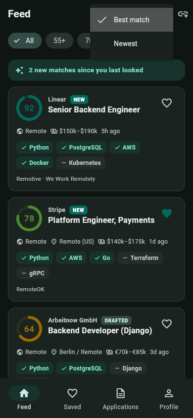

### 🔍 Transparent scoring — "why this ranks"
No black box. The detail screen breaks the score into its components (skill coverage, title
match, keywords, salary), shows which of your skills the role wants that your résumé is
**missing** (your gap to close), and lets you draft or apply.

  

### ✍️ One-tap AI applications
Turn any posting into a **tailored résumé and cover letter** generated against *that* job.
Pick a tone, regenerate on demand, and read the honest **"stretch claims"** note where the
model flags anything it inferred so you can verify it before sending.

  

### 🔗 Add any job — by link or by paste
Found a role the boards didn't surface? Paste its URL and Job Scalper fetches, parses
(including embedded **JSON-LD** structured data), scores, and pools it. If the page is a
JavaScript-only apply form that can't be read, switch to **Paste text** and drop the
description in directly. The URL fetch is **SSRF-hardened** — it refuses private/loopback
addresses before making a request.

  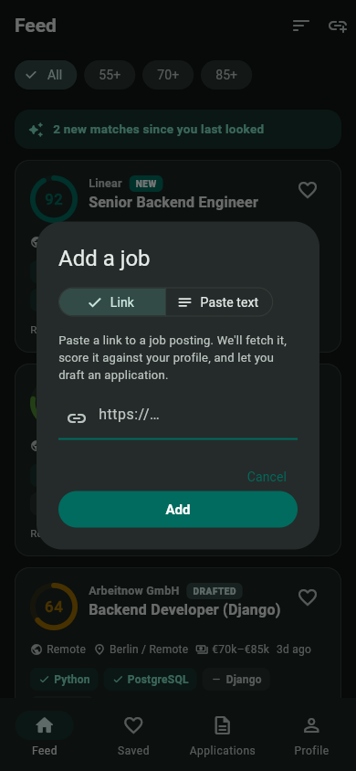
  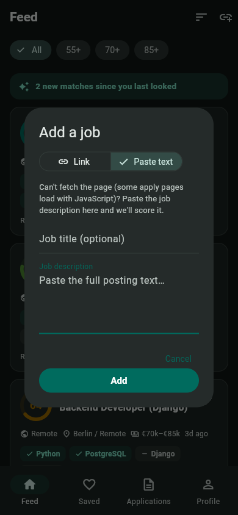

### 📊 Track the funnel to offer
Mark applications through their stages — applied → interviewing → offer / rejected — and
watch your pipeline build into a funnel with interview and offer rates. Turn attrition into
signal.

  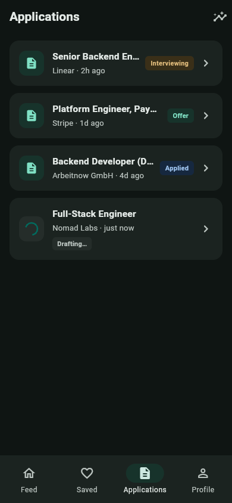
  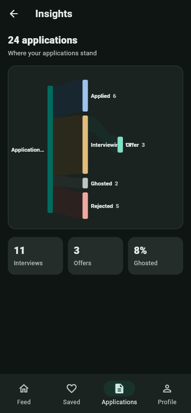

### 🔔 Profile, boards, notifications, and your own key
Build your profile from a résumé upload, choose which job boards to watch, get push
notifications when a high-scoring match appears, and bring your own LLM key with usage
tracking against your plan.

  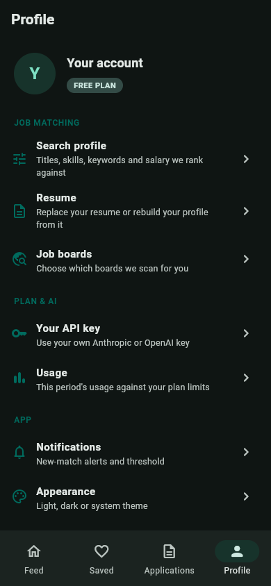
  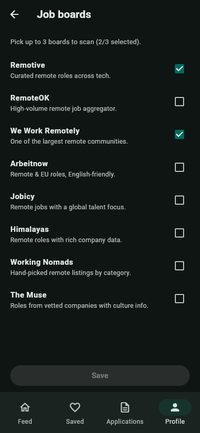
  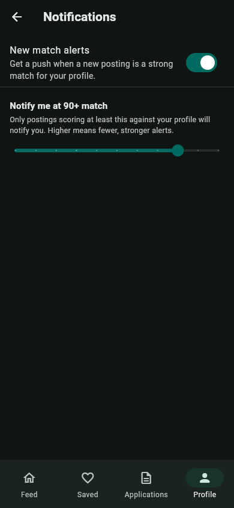
  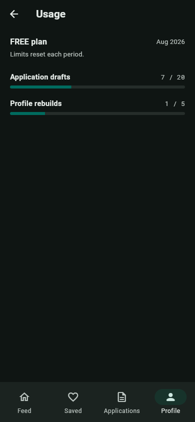

### 🌗 Designed for both themes
A clean Material 3 design that's fully realized in light and dark.

  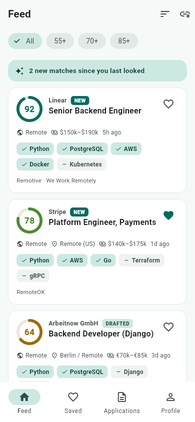
  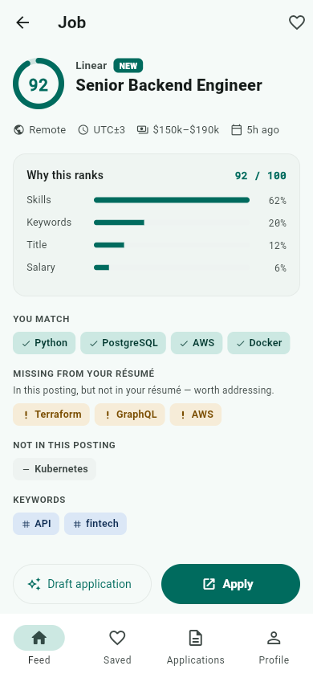
  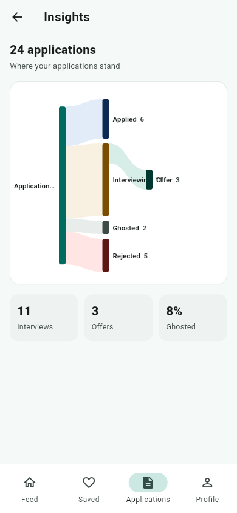

---

## Selling points

- **AI where it pays off, transparency where it matters.** LLM-tailored applications and
  résumé→profile parsing, but scoring you can *see* and inspect — not a mystery number.
- **The whole market, ranked.** Company-agnostic aggregation across many boards, deduped
  and scored, instead of yet another keyword search.
- **From listing to sent application in one screen** — tailored résumé, cover letter, tone,
  and an honesty check on inferred claims.
- **Nothing falls through the cracks** — a real application pipeline with funnel analytics.
- **Robust by construction** — SSRF-hardened imports, background jobs for heavy work,
  optimistic UI with server reconciliation, graceful-degrading scrapers.

---

## Architecture & tech

| Layer | Stack |
|---|---|
| **Mobile** | Flutter · Riverpod · go_router · Dio · Firebase Cloud Messaging |
| **API** | FastAPI (async) · Pydantic v2 · Google-OAuth ID-token auth |
| **Async work** | RQ + Redis worker (résumé parsing, draft generation, scraping) |
| **Data** | PostgreSQL via raw SQL + numbered `.sql` migrations |
| **AI** | Anthropic (platform default) with bring-your-own-key support |
| **Sources** | Pluggable adapter registry — structured JSON/RSS feeds + best-effort headless-browser scrapers |
| **Admin** | Server-rendered ops console (Jinja) behind an email allowlist |

**Engineering notes**

- **Clean separation of concerns:** repository layer over raw SQL, Pydantic transport
  schemas kept distinct from storage records, and a source-adapter registry where adding a
  board is one self-registering module.
- **Heavy operations are asynchronous:** the API returns a `job_id`; an RQ worker fills the
  result. The mobile client shows a *pending* state and polls to completion.
- **Optimistic UX:** saves, applied-state, and stage changes update instantly and reconcile
  with the server in the background.
- **Well tested:** 160+ backend tests (scoring, feed, imports, auth, insights, admin) plus
  a Flutter widget-test suite driving the real controllers against in-memory fakes — the
  same fakes that render these screenshots.

---

Screenshots are generated from the app's own web build with a seeded demo dataset
(`mobile/lib/main_portfolio.dart` + `mobile/tool/portfolio_shots.py`), so the UI is real,
only the data is illustrative.
